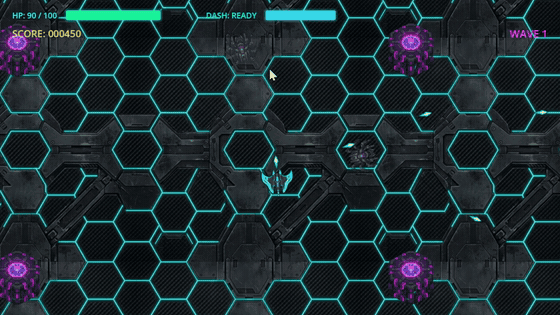

# Godot MCP

[](https://github.com/SrDarkoll/godot-mcp/actions/workflows/ci.yml)
[](LICENSE)
[](https://godotengine.org)
[](https://nodejs.org)
[](https://www.typescriptlang.org)
[](docs/architecture/tool-registry-profiles.md)
[](#authoritative-validation-evidence)

> **Give your AI coding assistants hands, eyes, and deep debugging powers directly inside Godot Engine 4.x.**

Godot MCP is an open-source, hardened Developer Preview [Model Context Protocol (MCP)](https://modelcontextprotocol.io/) server that connects modern AI assistants (Anthropic Claude Desktop, Cursor, Antigravity, Roo Code, Cline, and custom agents) directly to **Godot Engine 4.x**.

Instead of copying and pasting GDScript snippets, guessing node hierarchy paths, or struggling to describe visual bugs to an LLM, Godot MCP provides a bidirectional control plane: agents can inspect scene trees, author 2D/3D nodes, build TileMaps, edit animations, step through code with a live DAP debugger, and capture high-resolution viewport screenshots for visual grounding.

---

## Built with Godot MCP & Gemini 3.8 Flash



*NEON SWARM* is a fast-paced 2D cyberpunk top-down survival game created 100% autonomously by **Gemini 3.8 Flash** using **Godot MCP**—covering scene assembly, GDScript authoring, procedural audio, original artwork, and live DAP interactive debugging.

---

## Key Highlights & Superpowers

- 🎮 **Complete Editor & Scene Control**: Programmatically inspect, create, reparent, modify, and delete nodes, scenes, resources, and script signals without breaking scene structure.
- 🐞 **Interactive DAP Debugger (Phase 9)**: Real-time breakpoint management, stepping (into, over, out), call stack inspection, and lazy variable evaluation during live game execution.
- 👁️ **Visual Grounding & Viewport Capture**: Capture 2D and 3D editor viewports as well as running game frames as PNGs, enabling multimodal AI models to visually inspect level layouts, shaders, and lighting.
- ⚡ **Headless Process Manager (Phase 8)**: Run project validation, asset importing, automated tests, and background game instances without GUI dependencies—ideal for autonomous CI/CD or agent self-testing.
- 🛡️ **Transactional Safety & Reversibility**: Multi-file atomic write transactions (`transaction.*`), file checkpoints (`checkpoint.*`), and risk previews prevent unintended project corruption.
- 🎯 **8 Bounded Tool Profiles**: Select focused toolsets (`minimal`, `core`, `2d`, `3d`, `navigation`, `ui`, `runtime`, `full`) to drastically reduce LLM context token usage and latency.

---

## Architecture Overview

Godot MCP uses a decoupled, secure two-tier architecture communicating over standard MCP stdio on the client side and an authenticated loopback WebSocket (`127.0.0.1`) on the engine side.

```text
┌─────────────────────────────────────────────────────────────┐
│             AI Client (Claude, Cursor, Antigravity)         │
└──────────────────────────────┬──────────────────────────────┘
                               │ MCP Protocol (stdio / JSON-RPC)
                               ▼
┌─────────────────────────────────────────────────────────────┐
│                  Godot MCP Server (Node.js 22+)             │
│  ├─ Tool Registry (183 tools across 8 profiles)             │
│  ├─ Headless Process Manager (Godot CLI runner)             │
│  ├─ DAP Client (Interactive debugger bridge)                │
│  ├─ Transaction & Snapshot Recovery Engine                  │
│  └─ Loopback WebSocket Server (127.0.0.1:<dynamic-port>)     │
└──────────────────────────────┬──────────────────────────────┘
                               │ Authenticated Handshake (Token)
                               ▼
┌─────────────────────────────────────────────────────────────┐
│                    Godot 4.x Engine Instance                │
│  ├─ EditorPlugin (addons/godot_mcp)                         │
│  ├─ SceneTree & Resource Mutator                            │
│  ├─ 2D & 3D Viewport Grabbers                               │
│  └─ Runtime Autoload & Diagnostics Bridge                   │
└─────────────────────────────────────────────────────────────┘
```

---

## Authoritative Validation Evidence

Godot MCP is verified against **live Godot 4.6.3 on Windows** through 10 strict validation gates:

| Scope | Metrics | Status |
| :--- | :--- | :---: |
| **Tool Surface** | 183 canonical MCP tools across 8 profiles (`minimal`, `core`, `2d`, `3d`, `navigation`, `ui`, `runtime`, `full`) | ✅ PASS |
| **Protocol Unit Tests** | 52/52 tests passed (`@godot-mcp/protocol`) | ✅ PASS |
| **Server Unit Tests** | 250/250 tests passed (`@godot-mcp/server`) | ✅ PASS |
| **CLI Unit Tests** | 11/11 tests passed (CLI workspace) | ✅ PASS |
| **General Integration** | 15 test files (16 tests) driving live Godot 4.x EditorPlugin mutation lifecycle | ✅ PASS |
| **Runtime Integration** | 3 test files (10 tests) controlling live game execution, inspection & native diagnostics | ✅ PASS |
| **Visual Integration** | 1 test file (2 tests) capturing real 2D & 3D viewport pixels with checksum validation | ✅ PASS |
| **Headless Manager** | 1 test file (1 test) validating autonomous headless project management without editor | ✅ PASS |
| **DAP Debugger** | 1 test file (2 tests) validating DAP stack, variables, stepping, breakpoints & reapply | ✅ PASS |
| **Tool Contracts** | 183/183 tools verified against canonical JSON schemas with zero drift | ✅ PASS |

---

## Tool Profiles

To keep LLM context sizes optimal and avoid prompt bloat, Godot MCP divides its 183 tools into 8 specialized profiles:

| Profile | Tools | Primary Focus | Included Capabilities |
| :--- | :---: | :--- | :--- |
| `minimal` | 3 | Liveness & Discovery | Session status, engine capabilities, tool registry |
| `core` | 31 | Project & Scene CRUD | Project info, scene tree, nodes, resources, atomic transactions |
| `2d` | 46 | 2D Game Development | Core + Node2D, Sprite2D, TileMapLayer, TileSet, Camera2D, Collision2D, Parallax2D |
| `3d` | 51 | 3D World Building | Core + Node3D, Mesh3D, Camera3D, Collision3D, Light3D, StandardMaterial3D, Shader3D |
| `navigation` | 40 | Navigation & Pathfinding | Core + 2D/3D NavigationRegion, NavigationMesh baking, NavigationAgent |
| `ui` | 44 | User Interface & Animation | Core + Control nodes, anchors, layout presets, AnimationPlayer & AnimationMixer |
| `runtime` | 49 | QA, Headless & Debugging | Core + headless process runner, game control, live inspect, interactive DAP debugger |
| `full` | 183 | Unrestricted Power-Agent | Complete tool surface across all domains (default) |

> **Tip:** You can set a default profile in `.godot-mcp/config.json` via `godot-mcp config <project> --tool-profile 2d` or override it on server start with `--tool-profile <name>`.

---

## Requirements & Compatibility Boundary

- **Operating System:** Windows 10/11 is the primary **Tier-1 validated target**. Linux and macOS are expected to work via Node.js and the Godot CLI, but are not yet Tier-1 validated in continuous integration.
- **Godot Engine:** Tested and hardened specifically against **Godot 4.6.3-stable** on Windows. Other Godot 4.x releases are expected to work, but have not been formally certified across all 10 gates.
- **Node.js:** v22.0.0 or newer.
- **Package Manager:** npm (bundled with Node.js).

---

## Quickstart

> **Public release target:** `@srdarkx/godot-mcp` is the sole public npm package. It is not published by this implementation step; until an explicit release is authorized, use the source-checkout flow below. The internal `@godot-mcp/*` packages remain bundled implementation details.

After a future authorized npm release, the zero-friction entry point is:

```powershell
npx -y @srdarkx/godot-mcp init . --client antigravity
```

### 1. Clone and Build

```powershell
git clone https://github.com/SrDarkoll/godot-mcp.git
cd godot-mcp
npm install
npm run build
```

### 2. Initialize Your Godot Project

Run the CLI `init` command pointing to your Godot project and your Godot executable:

```powershell
node ./packages/cli/dist/index.js init C:\path\to\YourGodotProject --godot C:\Tools\Godot\Godot_v4.6.3-stable_win64.exe
```

What `init` does automatically:
1. Copies the `addons/godot_mcp` EditorPlugin into your project.
2. Creates the `.godot-mcp/config.json` project configuration.
3. Automatically enables the plugin in Godot via headless invocation.

### 3. Verify with Doctor

Ensure your environment, permissions, and Godot executable are properly configured:

```powershell
node ./packages/cli/dist/index.js doctor C:\path\to\YourGodotProject --godot C:\Tools\Godot\Godot_v4.6.3-stable_win64.exe
```

---

## Client Configuration

Add Godot MCP to your preferred AI assistant configuration:

### Claude Desktop

Edit `%APPDATA%\Claude\claude_desktop_config.json`:

```json
{
  "mcpServers": {
    "godot": {
      "command": "node",
      "args": [
        "C:\\path\\to\\godot-mcp\\packages\\server\\dist\\index.js",
        "--project",
        "C:\\path\\to\\YourGodotProject",
        "--tool-profile",
        "full"
      ]
    }
  }
}
```

### Cursor

In `.cursor/mcp.json` (or Cursor Settings > Features > MCP):

```json
{
  "mcpServers": {
    "godot": {
      "command": "node",
      "args": [
        "C:/path/to/godot-mcp/packages/server/dist/index.js",
        "--project",
        "C:/path/to/YourGodotProject"
      ]
    }
  }
}
```

### Antigravity & Generic MCP Clients

Launch the server over stdio:

```powershell
node ./packages/server/dist/index.js --project C:\path\to\YourGodotProject --tool-profile full
```

---

## Example Prompts & Use Cases

Once connected, you can interact with your project naturally. Here are examples of what your AI can do:

### 🎨 Scene & Node Authoring
> *"Inspect the active scene tree. Add a `CharacterBody2D` named `Player` as a child of the root, attach a `Sprite2D` with texture `res://icon.svg`, and create a rectangular `CollisionShape2D`."*

### 🗺️ Level Design & TileMaps
> *"Inspect `res://levels/level_1.tscn`. Create a `TileMapLayer`, configure its TileSet from `res://tilesets/dungeon.tres`, and paint a 12x2 floor platform at coordinate (0, 10)."*

### 🐞 Interactive DAP Debugging
> *"Launch the game with the debugger attached. Place a breakpoint at line 35 of `res://scripts/player.gd`. When triggered, inspect the call stack and show me the value of `velocity` and `health`."*

### 📸 Visual Inspection & Shaders
> *"Capture the 3D viewport of the current editor view. Inspect the visual appearance of the water shader on the lake mesh, check lighting reflections, and adjust the roughness property to 0.2."*

### 🤖 Autonomous Verification Workflow
> *"Run `workflow.run_check` on `res://scenes/test_arena.tscn`. Run headless tests, capture the game frame after 2 seconds, verify there are zero script errors, and report a pass/fail verdict with evidence."*

---

## Safety & Reversibility

Godot MCP is built with strict safety guarantees to prevent AI agents from accidentally damaging your game assets:

1. **Declared Transactions (`transaction.*`)**: Agents can stage multiple file changes in an isolated transaction. If any operation fails, the entire transaction is rolled back automatically with zero partial writes.
2. **File Checkpoints (`checkpoint.*`)**: Creates snapshot restore points before complex refactors, allowing one-command restoration of critical files.
3. **Risk Preview (`risk.preview`)**: High-risk operations (such as file deletions or batch property overwrites) require explicit confirmation and permission checks.
4. **Isolated Loopback Security**: The WebSocket bridge binds strictly to `127.0.0.1` using short-lived tokens and randomized ports generated per session.

---

## Project Structure

```text
godot-mcp/
├── packages/
│   ├── protocol/       # Canonical JSON-RPC schemas, contracts, and TypeScript types
│   ├── server/         # Core MCP server, profiles, transaction manager, DAP client
│   ├── cli/            # CLI commands (init, doctor, config)
│   └── godot-addon/    # Godot 4 EditorPlugin (WebSocket bridge, viewport grabbers)
├── tests/
│   └── integration/    # Live Godot 4.x editor, runtime, headless & DAP test suites
├── docs/               # Comprehensive architecture, protocol, and tool documentation
└── scripts/            # CI scripts, code generators, and automated test runners
```

---

## Running Tests Locally

You can run individual test suites using the supported npm scripts:

```powershell
# Run unit tests across all packages (protocol, server, cli)
npm test

# Check type safety and tool schema synchronization
npm run typecheck
npm run check:tool-contracts

# Check Godot addon GDScript syntax
npm run check:godot

# Run live integration tests (requires Godot 4.x)
$env:GODOT_BIN = "C:\Tools\Godot\Godot_v4.6.3-stable_win64.exe"
$env:REQUIRE_GODOT_INTEGRATION = "1"
npm run test:integration

# Specific integration tiers
npm run test:integration:runtime    # Live game runtime & diagnostics
npm run test:integration:visual     # Viewport and game pixel capture
npm run test:integration:debugger   # DAP interactive debugger (Phase 9)
npm run test:distribution           # Packaged tarball distribution smoke test
```

To execute the complete 10-gate validation suite in a single automated run:

```powershell
powershell -ExecutionPolicy Bypass -File scripts/run-all-gates.ps1 -GodotBin "C:\Tools\Godot\Godot_v4.6.3-stable_win64.exe"
```

---

## Documentation Index

- [Architecture Foundation](docs/architecture/foundation.md)
- [Tool Registry & Profiles Guide](docs/architecture/tool-registry-profiles.md)
- [Protocol RPC Specification](docs/protocol/foundation-rpc.md)
- [2D Power Tools](docs/tools/2d.md)
- [3D & Materials Power Tools](docs/tools/3d-materials.md)
- [Navigation & AI Power Tools](docs/tools/navigation.md)
- [UI & Animation Power Tools](docs/tools/ui-animation.md)
- [TileMap & TileSet Power Tools](docs/tools/tilemap-tileset.md)
- [Runtime & DAP Debugger](docs/tools/runtime-debugger.md)
- [Visual Viewport Capture](docs/tools/visual-capture.md)
- [Transactions & Recovery](docs/tools/transactions-recovery.md)
- [Autonomous Verification Workflows](docs/tools/workflow.md)

---

## License

This project is licensed under the **MIT License**. See the [LICENSE](LICENSE) file for details.

Developed with passion for game development and AI engineering by [SrDarkoll](https://github.com/SrDarkoll).
